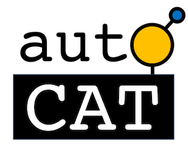

# AutoCat Documentation

{ align=right }

AutoCat is a suite of python tools for **sequential learning for materials applications** 
and **automating structure generation for DFT catalysis studies.**

Development of this package stems from [ACED](https://www.cmu.edu/aced/), as part of the 
ARPA-E DIFFERENTIATE program.

Below we provide an overview of the key functionalities of AutoCat. 
For additional details please see the User Guide, Tutorials, and API sections.

## Sequential Learning

One of the core philosophies of AutoCat is to provide modular and extensible tooling to
facilitate closed-loop computational materials discovery workflows. Within this submodule 
are classes for defining a design space, featurization, 
regression, selecting candidate systems, and defining a closed-loop sequential learning iterator. The 
key classes intended for each of these purposes are:

- [**`DesignSpace`**](User_Guide/Learning/sequential#designspace): define a design space to explore

- [**`Featurizer`**](User_Guide/Learning/featurizers): featurize the systems for regression

- [**`Predictor`**](User_Guide/Learning/predictors): a regressor for predicting materials properties

- [**`CandidateSelector`**](User_Guide/Learning/sequential.md#candidateselector): propose candidate system(s) 
for evaluation

- [**`SequentialLearner`**](User_Guide/Learning/sequential#sequentiallearner): define a closed-loop iterator 


## Structure Generation

{ align=right }

This submodule contains functions for automating atomic structure generation 
within the context of a catalysis study using density functional theory. 
Specifically, this includes generating bulk structures, surfaces, and 
placing adsorbates. In addition, functions for generating the single-atom alloys 
material class are also included. These functions are organized within AutoCat as follows:

- [**`autocat.bulk`**](User_Guide/Structure_Generation/bulk): generation of periodic 
mono-elemental bulk structures

- [**`autocat.surface`**](User_Guide/Structure_Generation/surface): mono-elemental surface slab generation

- [**`autocat.adsorption`**](User_Guide/Structure_Generation/adsorption): placement of adsorbates onto surfaces

- [**`autocat.saa`**](User_Guide/Structure_Generation/saa): generation of single-atom alloy surfaces

Structures generated or read with this package are typically of the form of 
[`ase.Atoms`](https://wiki.fysik.dtu.dk/ase/ase/atoms.html#module-ase.atoms) 
objects.

When opting to write structures to 
disk using these functions, they are automatically organized into a clean, scalable directory organization. 
All structures are written in the 
[`ase.io.Trajectory`](https://wiki.fysik.dtu.dk/ase/ase/io/trajectory.html#trajectory) 
file format. 
For further details on the directory structure, see the User Guide.

## Installation

There are two options for installation, either via `pip` or from the repo directly.

### `pip` (recommended)

If you are planning on strictly using AutoCat rather than contributing to development,
 we recommend using `pip` within a virtual environment (e.g. 
 [`conda`](https://docs.conda.io/en/latest/)
 ). This can be done
as follows:

```
pip install autocat
```

### Github (for developers)

Alternatively, if you would like to contribute to the development of this software,
AutoCat can be installed via a clone from Github. First, you'll need to clone the
github repo to your local machine (or wherever you'd like to use AutoCat) using
`git clone`. Once the repo has been cloned, you can install AutoCat as an editable
package by changing into the created directory (the one with `setup.py`) and installing
via: 
```
pip install -e .
```

## Contributing
Contributions through issues, feature requests, and pull requests are welcome. 
Guidelines are provided here.
