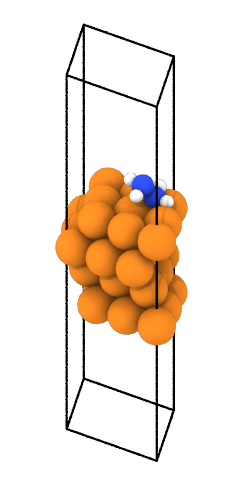

{ align=right }
Tools within 
[`autocat.adsorption`](../../API/Structure_Generation/adsorption.md) 
are geared towards generating structures with adsorbates placed on
a candidate catalyst surface.

## Placing a single adsorbate

The core function of this module is
[`generate_adsorbed_structures`](../../API/Structure_Generation/adsorption.md#autocat.adsorption.generate_adsorbed_structures)
 for generating multiple structures with one adsorbate placed via a single function call.

For the oxygen reduction (ORR) and nitrogen reduction (NRR) reactions,
AutoCat has default starting geometries for all of these intermediates
which can be found in [`autocat.data.intermediates`](../Data/intermediates.md). 

In addition, by default initial heights of the adsorbates are guessed based
upon the vdW radii of the nearest neighbors to the anchoring atom. 

In the example below we are generating adsorption structures for all ORR intermediates
on all of the identified unique symmetry sites on a Pt111 slab. The unique sites are
identified using the Delaunay triangulation, as implemented in `pymatgen`. 
Additionally, by default initial heights of the adsorbates are guessed based
upon the vdW radii of the nearest neighbors to the anchoring atom.

```py
>>> from autocat.surface import generate_surface_structures
>>> from autocat.data.intermediates import ORR_INTERMEDIATE_NAMES
>>> from autocat.adsorption import generate_adsorbed_structures
>>> surface_dict = generate_surface_structures(
...     species_list=["Pt"], facets={"Pt": ["111"]}, n_fixed_layers=2
... )
>>> surface = surface_dict["Pt"]["fcc111"]["structure"]
>>> ads_dict = generate_adsorbed_structures(
...     surface=surface,
...     use_all_sites=True,
...     ads=ORR_INTERMEDIATE_NAMES,
...     write_to_disk=True,
... )
Structure with OOH adsorbed at ontop/0.0_0.0 written to ./adsorbates/OOH/ontop/0.0_0.0/input.traj
Structure with OOH adsorbed at bridge/8.316_2.4 written to ./adsorbates/OOH/bridge/8.316_2.4/input.traj
Structure with OOH adsorbed at hollow/8.316_1.6 written to ./adsorbates/OOH/hollow/8.316_1.6/input.traj
Structure with OOH adsorbed at hollow/5.544_3.201 written to ./adsorbates/OOH/hollow/5.544_3.201/input.traj
Structure with O adsorbed at ontop/0.0_0.0 written to ./adsorbates/O/ontop/0.0_0.0/input.traj
Structure with O adsorbed at bridge/8.316_2.4 written to ./adsorbates/O/bridge/8.316_2.4/input.traj
Structure with O adsorbed at hollow/8.316_1.6 written to ./adsorbates/O/hollow/8.316_1.6/input.traj
Structure with O adsorbed at hollow/5.544_3.201 written to ./adsorbates/O/hollow/5.544_3.201/input.traj
Structure with OH adsorbed at ontop/0.0_0.0 written to ./adsorbates/OH/ontop/0.0_0.0/input.traj
Structure with OH adsorbed at bridge/8.316_2.4 written to ./adsorbates/OH/bridge/8.316_2.4/input.traj
Structure with OH adsorbed at hollow/8.316_1.6 written to ./adsorbates/OH/hollow/8.316_1.6/input.traj
Structure with OH adsorbed at hollow/5.544_3.201 written to ./adsorbates/OH/hollow/5.544_3.201/input.traj
>>> ads_dict
{'OOH': {'ontop': {'0.0_0.0': {'structure': Atoms(...),
                               'traj_file_path': './adsorbates/OOH/ontop/0.0_0.0/input.traj'}},
         'bridge': {'7.623_6.001': {'structure': Atoms(...),
                                    'traj_file_path': './adsorbates/OOH/bridge/7.623_6.001/input.traj'}},
         'hollow': {'6.93_5.601': {'structure': Atoms(...),
                                   'traj_file_path': './adsorbates/OOH/hollow/6.93_5.601/input.traj'},
                    '9.702_4.001': {'structure': Atoms(...),
                                    'traj_file_path': './adsorbates/OOH/hollow/9.702_4.001/input.traj'}}},
 'O': {'ontop': {'0.0_0.0': {'structure': Atoms(...),
                             'traj_file_path': './adsorbates/O/ontop/0.0_0.0/input.traj'}},
       'bridge': {'7.623_6.001': {'structure': Atoms(...),
                                  'traj_file_path': './adsorbates/O/bridge/7.623_6.001/input.traj'}},
       'hollow': {'6.93_5.601': {'structure': Atoms(...),
                                 'traj_file_path': './adsorbates/O/hollow/6.93_5.601/input.traj'},
                  '9.702_4.001': {'structure': Atoms(...),
                                  'traj_file_path': './adsorbates/O/hollow/9.702_4.001/input.traj'}}},
 'OH': {'ontop': {'0.0_0.0': {'structure': Atoms(...),
                              'traj_file_path': './adsorbates/OH/ontop/0.0_0.0/input.traj'}},
        'bridge': {'7.623_6.001': {'structure': Atoms(...),
                                   'traj_file_path': './adsorbates/OH/bridge/7.623_6.001/input.traj'}},
        'hollow': {'6.93_5.601': {'structure': Atoms(...),
                                  'traj_file_path': './adsorbates/OH/hollow/6.93_5.601/input.traj'},
                   '9.702_4.001': {'structure': Atoms(...),
                                   'traj_file_path': './adsorbates/OH/hollow/9.702_4.001/input.traj'}}},
```

In general the dictionary generated has the following organization: 

```
{ADSORBATE_SPECIES: 
    {SITE_LABEL: 
        {XY: {"structure": Atoms, "traj_file_path": TRAJFILEPATH}}}, 
```
When writing these adsorbed structures to disk it is done with the following subdirectory
format (mimicing the organization of the dictionary).

```
.
├── adsorbates
│   ├── O
│   │   ├── bridge
│   │   │   └── 7.623_6.001
│   │   │       └── input.traj
│   │   ├── hollow
│   │   │   ├── 6.93_5.601
│   │   │   │   └── input.traj
│   │   │   └── 9.702_4.001
│   │   │       └── input.traj
│   │   └── ontop
│   │       └── 0.0_0.0
│   │           └── input.traj
│   ├── OH
│   │   ├── bridge
│   │   │   └── 7.623_6.001
│   │   │       └── input.traj
│   │   ├── hollow
│   │   │   ├── 6.93_5.601
│   │   │   │   └── input.traj
│   │   │   └── 9.702_4.001
│   │   │       └── input.traj
│   │   └── ontop
│   │       └── 0.0_0.0
│   │           └── input.traj
│   └── OOH
│       ├── bridge
│       │   └── 7.623_6.001
│       │       └── input.traj
│       ├── hollow
│       │   ├── 6.93_5.601
│       │   │   └── input.traj
│       │   └── 9.702_4.001
│       │       └── input.traj
│       └── ontop
│           └── 0.0_0.0
│               └── input.traj
```

Instead of generating the adsorption structures for all unique sites, 
the xy coordinates of individual sites may be specified using the `adsorption_sites`
 parameter. Here we can give each of these sites custom labels to be used for referencing 
 and writing to disk.

```py
>>> from autocat.surface import generate_surface_structures
>>> from autocat.adsorption import generate_adsorbed_structures
>>> surface_dict = generate_surface_structures(
...     species_list=["Pt"], facets={"Pt": ["111"]}, n_fixed_layers=2
... )
>>> surface = surface_dict["Pt"]["fcc111"]["structure"]
>>> x = surface[15].x
>>> x
4.1577878733769
>>> y = surface[15].y
>>> y
5.6011665451642
>>> sites = {"Li": {"custom": [(x,y)]}}
>>> ads_dict = generate_adsorbed_structures(
...     surface=surface,
...     adsorbates=["Li"],
...     use_all_sites=False,
...     adsorption_sites=site,
...     write_to_disk=True,
... )
Structure with Li adsorbed at custom/4.158_5.601 written to ./adsorbates/Li/custom/4.158_5.601/input.traj
>>> ads_dict
{'Li': {'custom': {'4.158_5.601': {'structure': Atoms(...),
                                   'traj_file_path': './adsorbates/Li/custom/4.158_5.601/input.traj'}}}}
```

If we are dealing with multiple adsorbates, adsorption sites, heights, etc.. that we want to 
treat differently depending on the combination, we can leverage the `dict` option for each of these 
inputs. The example below illustrates this capability, where can be used to specify adsorbates.

```py
>>> from autocat.surface import generate_surface_structures
>>> from autocat.adsorption import generate_adsorbed_structures
>>> surface_dict = generate_surface_structures(
...     species_list=["Pt"], facets={"Pt": ["111"]}, n_fixed_layers=2
... )
>>> surface = surface_dict["Pt"]["fcc111"]["structure"]
>>> sites = {"Li": {"origin": [(0.,0.)]}, "H": {"custom": [(0.5, 0.5)]}}
>>> ads_dict = generate_adsorbed_structures(
...     surface=surface,
...     adsorbates=["Li", "H", "N"],
...     use_all_sites={"Li": False, "H": False, "N": True},
...     heights={"H": 1.2}
...     adsorption_sites=sites,
...     write_to_disk=True,
... )
```