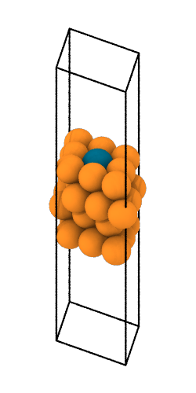

{ align=right }
Single atom alloys (SAA) consist of a transition-metal host 
with lone dopant atoms embedded at the surface. This 
dispersion leads to unique electronic properties.

With the [`autocat.saa`](../../API/Structure_Generation/saa.md) 
module, we can generate structures of these
systems to study them further. The main function for this purpose
is [`generate_saa_structures`](../../API/Structure_Generation/saa.md#autocat.saa.generate_saa_structures) 
where multiple SAA structures can 
be generated simultaneously.

```py
>>> from autocat.saa import generate_saa_structures
>>> saa_dict = generate_saa_structures(
...     host_species=["Fe", "Cu"],
...     dopant_species=["Pt", "Au"],
...     facets={"Fe": ["110"], "Cu": ["111"]},
...     n_fixed_layers=2,
...     write_to_disk=True,
... )
Pt1/Fe(bcc110) structure written to ./Fe/Pt/bcc110/substrate/input.traj
Au1/Fe(bcc110) structure written to ./Fe/Au/bcc110/substrate/input.traj
Pt1/Cu(fcc111) structure written to ./Cu/Pt/fcc111/substrate/input.traj
Au1/Cu(fcc111) structure written to ./Cu/Au/fcc111/substrate/input.traj
>>> saa_dict
{'Fe': {'Pt': {'bcc110': {'structure': Atoms(...),
                          'traj_file_path': './Fe/Pt/bcc110/substrate/input.traj'}},
        'Au': {'bcc110': {'structure': Atoms(...),
                          'traj_file_path': './Fe/Au/bcc110/substrate/input.traj'}}},
 'Cu': {'Pt': {'fcc111': {'structure': Atoms(...),
                          'traj_file_path': './Cu/Pt/fcc111/substrate/input.traj'}},
        'Au': {'fcc111': {'structure': Atoms(...),
                          'traj_file_path': './Cu/Au/fcc111/substrate/input.traj'}}}}
```
Here we generated SAA slabs with Fe and Cu as hosts and Pt and Au dopants under the following conditions:

- for Fe (Cu) we only need the 110 (111) facet
- the bottom 2 layers are held fixed

When writing to disk the following directory structure is used:
```
.
├── Cu
│   ├── Au
│   │   └── fcc111
│   │       └── substrate
│   │           └── input.traj
│   └── Pt
│       └── fcc111
│           └── substrate
│               └── input.traj
├── Fe
│   ├── Au
│   │   └── bcc110
│   │       └── substrate
│   │           └── input.traj
│   └── Pt
│       └── bcc110
│           └── substrate
│               └── input.traj
```

**N.B.** by default, initial magnetic moments are given to the dopant species based upon
the ground state magnetic moment of the species
